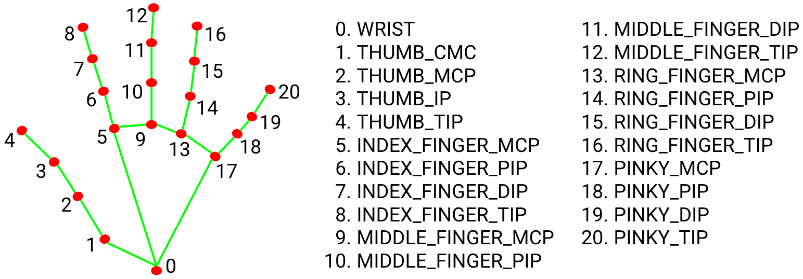
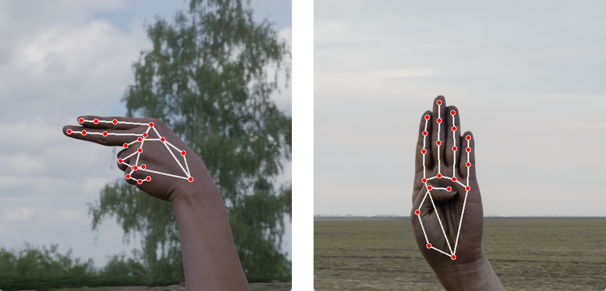

# Prédiction American Sign Language
Modèle de prédiction en temps réel des signes de l'American Sign Language depuis la webcam avec SVC.

## Instructions

Python 3.11 ou 3.12 recommandé

1. **Installer les dépendances :**

```bash
   pip install -r requirements.txt
```

   Ou dans un environnement virtuel :
```bash
   python -m venv env
   source env/bin/activate  # Linux / macOS
   env\Scripts\activate     # Windows
   pip install -r requirements.txt
```

2. **Lancer le projet :**

   Une webcam est nécessaire.
```bash
   python src/main.py
```


## Choix de conception

### Feature extraction

Initialement, l'idée était d'entraîner un classificateur d'images pour prédire le signe ASL associé, en classifiant chaque image capturée par la webcam en temps réel.
Cette approche n'était en réalité pas optimisée.
Afin d'avoir suffisamment d'informations, il aurait fallu travailler avec des images dont la résolution est de 256x256, soit $2^{16} = 65536$ pixels.
Avec autant de features, classifier 24 images par seconde en temps réel aurait été impossible.
Bien qu'il soit possible de réduire ce nombre de dimensions à l'aide d'une PCA, le pré-traitement resterait trop lourd pour un usage en temps réel.

J'ai donc opté pour une approche avec extraction de points directement sur les mains, à l'aide de la bibliothèque Mediapipe, qui détecte la main dans l'image et en extrait 21 points clés avec pour chacun de ces points ses coordonnées $(x, y, z)$ dans l'espace 3D. 



Pour chacune des images du dataset, MediaPipe a été utilisé pour projeter 21 points sur la main et en extraire les coordonnées $(x, y, z)$, soit 63 features au total, exportées dans un fichier CSV pour l'entraînement du modèle.




### Pré-traitement

Lors de la première implémentation, le dataset ne contenait que des images d'une seule main. Le modèle était donc capable de prédire le signe sur une main gauche, mais incapable de le prédire correctement sur une main droite. 
Avant de passer à un dataset contenant les deux mains, la solution consistait a dupliquer chaque ligne du dataset en inversant la coordonnée $x$ de chaque point, afin de simuler un effet miroir.

Lorsque l'on travaille dans un espace à trois dimensions, il faut distinguer les coordonnées locales et globales d'un objet. Ici lorsque l'on récupère les coordonnées $(x, y, z)$ d'un point, elles correspondent aux coordonnées dites absolues, soit la position de chaque point sur l'écran. 
Dans le dataset, toutes les mains sont centrées. Le problème n'apparaît qu'en conditions réelles, avec la webcam.
On risque de classifier les signes en fonction de la position des points sur l'écran plutôt que la position relative des points par rapport à l'origine de la main. 
La solution était donc de considérer comme origine le point moyen, donc $(\mu_x, \mu_y, \mu_z)$, et soustraire cette origine à chaque point.

Un autre problème détecté lors de l'utilisation du modèle avec la webcam est la distance entre la main et la camera. Dans le dataset, toutes les mains sont à la même distance de la camera, alors qu'en conditions réelles l'utilisateur peut s'approcher ou s'éloigner de la camera. 
Il fallait donc normaliser les données. Pour ce faire, il s'agissait de trouver une distance anatomiquement stable qui ne change pas en fonction des signes. La distance entre le poignet et la base du majeur est fixe et indépendante du signe réalisé par l'utilisateur. On divise donc chaque coordonnée par cette distance

Le pré-traitement appliqué à chaque point est donc le suivant :

$$p'_{k,i} = \frac{p_{k,i} - (\mu_x, \mu_y, \mu_z)}{d(p_{k,0}, p_{k,9})}$$
Où $p_{k,i}$ désigne le $i$-ème point de la $k$-ème main, et $d(p_{k,0}, p_{k,9})$ la distance euclidienne entre le poignet et la base du majeur.

### Choix du modèle

#### SVC
Un Support Vector Classifier (SVC) de scikit-learn a été utilisé. Deux modèles ont été comparés : l'un entraîné sur les coordonnées absolues, l'autre sur les coordonnées relatives.

|Données|Train|Test|
|-|-|-|
|Coordonnées absolues|89.3%|91.1%|
|Coordonnées relatives|98.9%|98.2%|

Les résultats sur coordonnées absolues ne sont pas représentatifs des conditions réelles, comme indiqué précédemment : dans le dataset, toutes les mains sont centrées, ce qui masque le biais de position.

#### Modèle bayésien

Un modèle probabiliste Gaussian Naive Bayes a été envisagé. 
Cependant, l'hypothèse d'indépendance du Naive Bayes n'est pas satisfaite car les coordonnées des articulations d'un même doigt sont corréllées entre elles. 
De plus, pour chaque classe, la distribution de la coordonnée $x$ présente deux pics distincts car le dataset contient des mains gauches et droites.
Une piste envisagée était de doubler le nombre de classes (de 26 à 52) afin de prédire à la fois le signe et la direction de la main.
Cette approche n'a pas été retenue et le modèle bayésien a été abandonné au profit du SVC.
